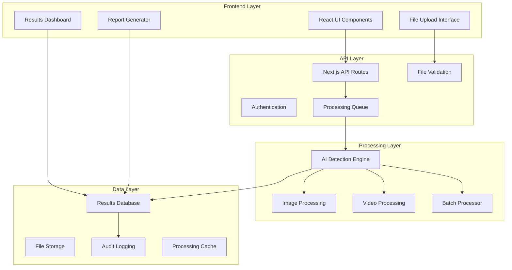

# Design Document

## Overview

The AI-driven NDT defect detection system will be built as a modern web application using Next.js 15, React 18, and TypeScript. The system will provide an intuitive interface for uploading component images/videos, processing them through AI models for defect detection, and generating comprehensive reports. The architecture will be designed for scalability, supporting both individual and batch processing workflows while maintaining high performance and reliability.

## Architecture

### High-Level Architecture



### Technology Stack

- **Frontend**: Next.js 15, React 18, TypeScript, Tailwind CSS
- **Backend**: Next.js API Routes, Node.js
- **AI/ML**: TensorFlow.js or ONNX.js for client-side inference, with fallback to cloud-based models
- **File Storage**: Local filesystem with option for cloud storage (AWS S3, Azure Blob)
- **Database**: SQLite for development, PostgreSQL for production
- **Image Processing**: Sharp.js for image manipulation
- **Video Processing**: FFmpeg.js for video frame extraction
- **State Management**: React Context API with useReducer
- **File Upload**: Custom drag-and-drop with progress tracking

## Components and Interfaces

### Core Components

#### 1. File Upload Component
```typescript
interface FileUploadProps {
  onFilesSelected: (files: File[]) => void;
  acceptedFormats: string[];
  maxFileSize: number;
  maxFiles: number;
  supportsBatch: boolean;
}

interface UploadedFile {
  id: string;
  file: File;
  status: 'pending' | 'uploading' | 'processing' | 'completed' | 'error';
  progress: number;
  preview?: string;
}
```

#### 2. AI Detection Engine Interface
```typescript
interface DefectDetectionEngine {
  processImage(imageData: ImageData, config: DetectionConfig): Promise<DetectionResult>;
  processVideo(videoFile: File, config: DetectionConfig): Promise<DetectionResult[]>;
  processBatch(files: File[], config: DetectionConfig): Promise<BatchResult>;
}

interface DetectionConfig {
  componentType: ComponentType;
  sensitivity: number;
  defectTypes: DefectType[];
  confidenceThreshold: number;
}

interface DetectionResult {
  id: string;
  fileName: string;
  defects: Defect[];
  overallStatus: 'pass' | 'fail' | 'review';
  processingTime: number;
  timestamp: Date;
}

interface Defect {
  type: DefectType;
  confidence: number;
  location: BoundingBox;
  severity: 'low' | 'medium' | 'high' | 'critical';
  description: string;
  affectedArea: number;
}
```

#### 3. Results Dashboard Component
```typescript
interface ResultsDashboardProps {
  results: DetectionResult[];
  onResultSelect: (result: DetectionResult) => void;
  onExport: (format: ExportFormat) => void;
  filters: ResultFilters;
}

interface ResultFilters {
  dateRange: DateRange;
  defectTypes: DefectType[];
  severityLevels: SeverityLevel[];
  status: ResultStatus[];
}
```

#### 4. Report Generator
```typescript
interface ReportGenerator {
  generateSingleReport(result: DetectionResult): Report;
  generateBatchReport(results: DetectionResult[]): BatchReport;
  generateAuditReport(criteria: AuditCriteria): AuditReport;
  exportReport(report: Report, format: ExportFormat): Promise<Blob>;
}

interface Report {
  id: string;
  title: string;
  generatedAt: Date;
  summary: ReportSummary;
  details: ReportDetails;
  recommendations: string[];
}
```

### Data Models

#### Component Profile
```typescript
interface ComponentProfile {
  id: string;
  name: string;
  materialType: MaterialType;
  criticalDefects: DefectType[];
  defaultSensitivity: number;
  qualityStandards: QualityStandard[];
  customParameters: Record<string, any>;
}

enum MaterialType {
  METAL = 'metal',
  PLASTIC = 'plastic',
  COMPOSITE = 'composite',
  CERAMIC = 'ceramic'
}

enum DefectType {
  CRACK = 'crack',
  CORROSION = 'corrosion',
  DEFORMATION = 'deformation',
  SURFACE_IRREGULARITY = 'surface_irregularity',
  INCLUSION = 'inclusion',
  VOID = 'void',
  DIMENSIONAL_VARIANCE = 'dimensional_variance'
}
```

#### Processing Queue
```typescript
interface ProcessingJob {
  id: string;
  userId: string;
  files: ProcessingFile[];
  config: DetectionConfig;
  status: JobStatus;
  priority: number;
  createdAt: Date;
  startedAt?: Date;
  completedAt?: Date;
  progress: number;
  estimatedCompletion?: Date;
}

enum JobStatus {
  QUEUED = 'queued',
  PROCESSING = 'processing',
  COMPLETED = 'completed',
  FAILED = 'failed',
  CANCELLED = 'cancelled'
}
```

## Error Handling

### Error Categories and Handling Strategy

#### 1. File Upload Errors
- **Invalid Format**: Display user-friendly message with supported formats
- **File Too Large**: Show size limit and suggest compression
- **Network Issues**: Implement retry mechanism with exponential backoff
- **Storage Full**: Graceful degradation with cleanup of temporary files

#### 2. AI Processing Errors
- **Model Loading Failure**: Fallback to cloud-based processing
- **Insufficient Memory**: Implement image resizing and batch size reduction
- **Processing Timeout**: Queue job for retry with lower resolution
- **Invalid Input Data**: Preprocessing validation and sanitization

#### 3. System Errors
- **Database Connection**: Implement connection pooling and retry logic
- **API Rate Limits**: Queue management with throttling
- **Authentication Failures**: Clear error messages and re-authentication flow

### Error Recovery Mechanisms
```typescript
interface ErrorHandler {
  handleUploadError(error: UploadError): ErrorResponse;
  handleProcessingError(error: ProcessingError): ErrorResponse;
  handleSystemError(error: SystemError): ErrorResponse;
  retryOperation(operation: Operation, maxRetries: number): Promise<any>;
}

interface ErrorResponse {
  message: string;
  code: string;
  recoverable: boolean;
  suggestedAction: string;
  retryAfter?: number;
}
```

## Testing Strategy

### Unit Testing
- **Component Testing**: React Testing Library for UI components
- **API Testing**: Jest for API route handlers
- **Utility Functions**: Comprehensive test coverage for image processing utilities
- **AI Model Testing**: Mock AI responses for consistent testing

### Integration Testing
- **File Upload Flow**: End-to-end upload and processing pipeline
- **Batch Processing**: Multi-file processing scenarios
- **Error Scenarios**: Network failures, invalid files, processing errors
- **Database Operations**: CRUD operations and data integrity

### Performance Testing
- **Load Testing**: Concurrent file uploads and processing
- **Memory Usage**: Large file handling and memory cleanup
- **Processing Speed**: AI model inference benchmarks
- **Scalability**: Batch processing with varying file sizes

### User Acceptance Testing
- **Usability Testing**: Interface intuitiveness and workflow efficiency
- **Accuracy Testing**: AI model performance on known defect samples
- **Cross-browser Testing**: Compatibility across major browsers
- **Mobile Responsiveness**: Touch interface and mobile performance

### Test Data Strategy
```typescript
interface TestDataManager {
  generateSampleImages(defectTypes: DefectType[]): Promise<File[]>;
  createMockDetectionResults(count: number): DetectionResult[];
  setupTestDatabase(): Promise<void>;
  cleanupTestData(): Promise<void>;
}
```

### Continuous Integration
- **Automated Testing**: Run full test suite on every commit
- **Performance Benchmarks**: Track processing speed and accuracy metrics
- **Security Scanning**: Automated vulnerability assessment
- **Code Quality**: ESLint, Prettier, and TypeScript strict mode

### Testing Environment Setup
- **Development**: Local SQLite database with sample data
- **Staging**: Production-like environment with realistic data volumes
- **Production**: Monitoring and alerting for real-world performance

The testing strategy ensures reliability, performance, and user satisfaction while maintaining code quality and system stability throughout the development lifecycle.